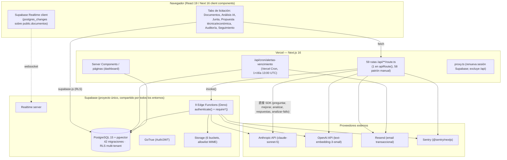
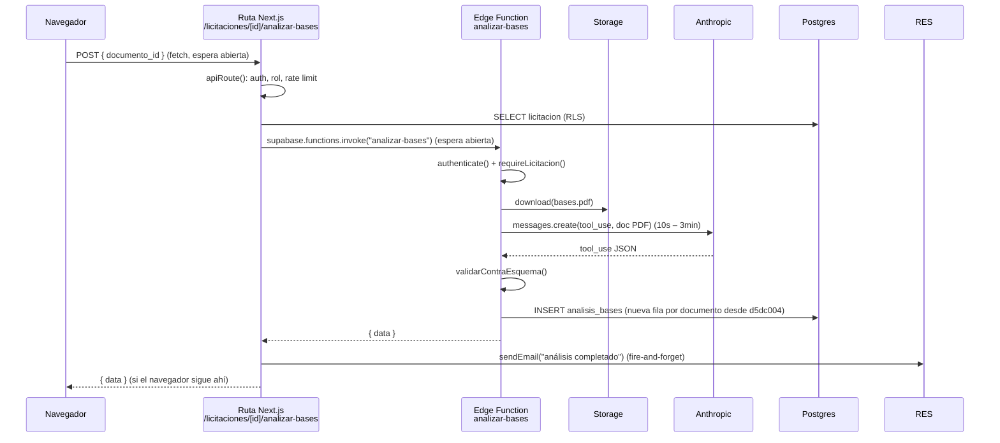

# P2 · Entregable 1 — Arquitectura actual y cuellos de botella

Estado del repo al crear la rama `architecture/p2-production-readiness` (base `quality/p1-stability-and-testing`).

---

## 1. Vista de componentes

## 2. Flujo de una operación de IA hoy (ejemplo: "Analizar bases")

**Duración total observable:** desde ~15 s (documento chico, IA rápida) hasta el timeout. Todo ese tiempo hay **tres** conexiones HTTP abiertas encadenadas (navegador→ruta, ruta→Edge Function, Edge Function→Anthropic) y ninguna de ellas sobrevive a un fallo intermedio.

## 3. Inventario de operaciones síncronas largas

| Operación | Entrada | Ruta / Edge Function | IA | Duración típica | Qué pasa si se corta a la mitad |
|---|---|---|---|---|---|
| Procesar documento (OCR + extracción + chunking + embeddings) | PDF hasta ~50 MB | ruta `procesar-documento` → EF `procesar-documento` | Claude (solo si escaneado) + OpenAI embeddings (lotes de 20) | 20 s – 5 min | `documentos.procesado` puede quedar `true` sin chunks, o chunks parciales; sin reanudación |
| Analizar bases | `documento_id` | ruta `analizar-bases` → EF `analizar-bases` | Claude tool_use | 15 s – 3 min | Sin fila `analisis_bases`; reintento manual completo |
| Estudio de mercado | licitación + partidas | ruta `estudio-mercado` → EF `generar-estudio-mercado` | Claude + web_search | 30 s – 4 min | Igual |
| Generar preguntas de junta | licitación | ruta `junta-aclaraciones/generar` → EF | Claude | 20 s – 2 min | Igual; **sin `requiereIA`** (no cuenta contra presupuesto) |
| Generar propuesta técnica | licitación + perfil | ruta `propuesta-tecnica/generar` → EF | Claude (respuesta larga) | 40 s – 6 min | Igual; **sin `requiereIA`** |
| Mejorar redacción | HTML de una sección | ruta `propuesta-tecnica/mejorar` (SDK directo) | Claude | 10 s – 1 min | No persiste (aceptable) |
| Auditar documento (por ítem de checklist) | `documento_id` + `checklist_item_id` | ruta `checklist-items/[itemId]/documento` → EF `auditar-documento` | Claude | 15 s – 2 min | UPDATE previo sin verificar; sin resultado |
| Auditar expediente completo | licitación | ruta `auditoria/auditar-todos` → **N × EF `auditar-documento` en loop** + EF `auditar-expediente` | Claude × (N+1) | **N × 15 s en serie** — puede superar cualquier timeout | Loop sin `Promise.all`, sin límite de concurrencia, sin revisar resultado individual; vector de abuso de costo |
| Análisis de fallo | acta de fallo | ruta `seguimiento/analizar-fallo` (SDK directo) | OpenAI embeddings + Claude | 15 s – 2 min | INSERT parcial |
| RAG Q&A ("preguntar") | pregunta | ruta `preguntar` (SDK directo) | OpenAI + Claude | 5 s – 40 s | No persiste (aceptable) |
| Analizar documento corporativo | `documento_id` | ruta `.../documentos/[docId]/analizar` → EF | Claude | 15 s – 2 min | Igual |
| Procesar referencia legal | referencia | EF `procesar-referencia-legal` | Claude + OpenAI | 20 s – 3 min | Chunks parciales |

**Once tipos de operación** entran en el sistema de jobs de P2.1 (el brief los enumera; este inventario los mapea a su implementación real).

## 4. Límites de plataforma que hoy nadie respeta explícitamente

| Recurso | Límite real | Cómo se excede hoy |
|---|---|---|
| Supabase Edge Function wall-clock | ~150 s (plan free) / ~400 s CPU (plan pro) | `auditar-todos`, propuesta técnica larga, procesar PDF grande escaneado |
| Vercel Serverless Function | 60 s (Hobby) / configurable hasta 300 s (Pro, Fluid) — `vercel.json` no fija `maxDuration` | Rutas que hacen `invoke()` y esperan |
| Anthropic | rate limits por org-key + latencia p99 alta en respuestas largas | Sin backpressure; cada usuario dispara llamadas directas |
| OpenAI embeddings | 3000 RPM tier bajo | `procesar-documento` hace lotes de 20 en loop sin límite global |
| Postgres conexiones | pooler; RLS ejecuta helpers `SECURITY DEFINER` por fila | No medido; `search_chunks` con HNSW sin `ef_search` tuneado |
| Realtime | conexiones concurrentes por plan | Cada tab de Documentos abre una suscripción; sin límite ni cleanup verificado |
| `rate_limit_hits` / `ai_usage_log` | crecen sin retención | `check_rate_limit` borra su propia ventana; `ai_usage_log` no se purga nunca |

## 5. Cuellos de botella priorizados

### B1 — Trabajo pesado en petición HTTP abierta *(crítico, bloquea el criterio de terminación)*
Descrito arriba. Sin cola, sin worker, sin estado persistente del trabajo, sin reintento, sin idempotencia, sin cancelación, sin progreso, sin reanudación. La "notificación" es un email fire-and-forget desde la ruta, que solo se dispara si la ruta llegó a terminar.

### B2 — Sin gobierno de costo de IA por organización *(crítico)*
`check_ai_budget` es un único número global (`AI_DAILY_TOKEN_CAP`, default 3M tokens/día/org) verificado *antes* de llamar, con el conteo *real* registrado *después* vía `registrar_uso_ia`. No hay: estimación previa de tamaño, reserva de cuota, conciliación, liberación si falla, cuota mensual, límite por operación, concurrencia máxima por org, allowlist de modelos, política económico-vs-avanzado, caché por hash de contenido, ni deduplicación de embeddings. `generar-preguntas-junta` y `generar-propuesta-tecnica` ni siquiera pasan `requiereIA`. Los reintentos de `withRetry` (3 intentos) son facturables y no se cuentan aparte.

### B3 — Resultados de IA sin versionado ni trazabilidad *(crítico)*
- `analisis_bases`: desde `d5dc004` guarda una fila por documento, pero re-analizar el mismo documento inserta otra fila sin marcar la anterior como reemplazada ni permitir comparar.
- `estudio_mercado`, `junta_aclaraciones` (`respuestas_json`), `seguimiento`: se sobrescriben.
- Ningún resultado registra: hash del documento, versión del prompt template, parámetros del modelo, latencia, nivel de confianza estructurado, qué chunks/evidencias se usaron, ni estado de aprobación humana.
- No hay `prompt_templates` versionados: los prompts son literales en el código de cada Edge Function / ruta (`conGuardia("...")`).
- `search_chunks` devuelve `contenido` y `similarity` pero la ruta `preguntar` solo guarda un extracto de 200 chars en la respuesta efímera — no se persiste la cita.

### B4 — Fan-out de IA sin control *(alto — costo y resiliencia)*
`auditar-todos` invoca `auditar-documento` N veces en serie dentro de un `for` sin límite de concurrencia, sin `Promise.all`, sin revisar el resultado de cada invocación, y sin contar el costo agregado contra ningún presupuesto por operación.

### B5 — Sin resiliencia ante fallo de proveedor *(alto)*
`withRetry` (Edge Functions) hace 3 reintentos con backoff exponencial **sin jitter** y reintenta *cualquier* error (incluido un 400 no reintentable). No hay circuit breaker, ni distinción de errores reintentables, ni fallback de modelo/proveedor, ni degradación funcional. Si Anthropic devuelve 529, las tres funciones que usan `withRetry` reintentan a la vez y luego lanzan; el documento puede quedar `procesado: true`. Si Resend falla en `staff/invitar`, un reintento del usuario crea una segunda invitación (sin idempotencia).

### B6 — Sin separación de entornos *(crítico — criterio de terminación)*
Un solo proyecto Supabase. `supabase/config.toml` no existe en el repo (solo `functions/deno.json`). Las migraciones se aplican con `supabase db push` contra ese proyecto. Los secretos (`ANTHROPIC_API_KEY`, `SERVICE_ROLE_KEY`, `CRON_SECRET`, `RESEND_API_KEY`) viven en un solo lugar por servicio. No hay staging con su propio proyecto Supabase ni su propio set de secretos. CI/CD: no hay workflows de GitHub en el repo (`.github/` ausente); el deploy es el default de Vercel (push → build) sin smoke tests, gating de migraciones, aprobación manual, ni canary.

### B7 — Rendimiento no medido *(alto — criterio de terminación)*
`@vercel/analytics` y `@vercel/speed-insights` están instalados pero no hay presupuestos de rendimiento, ni baseline de Core Web Vitals, TTFB, latencia de API p95, consultas lentas, o coste de RLS. El cliente carga react-pdf, TipTap (+6 extensiones de tabla), exceljs, docx y dnd-kit; varias tablas (`licitaciones`, documentos, actividad) se renderizan sin virtualización ni paginación consistente. Varias rutas hacen `select("*")` implícito o traen listas completas.

### B8 — Retención, borrado y DR ausentes *(crítico — criterio de terminación)*
- `rate_limit_hits` y `ai_usage_log` crecen indefinidamente.
- `document_chunks` (con `embedding vector(1536)`, ~6 KB/fila) no tiene política de retención.
- Borrado de organización = `ON DELETE CASCADE` desde `organizations`. No toca Storage (archivos huérfanos), ni jobs, ni logs externos (Sentry), ni confirma borrado en proveedores de IA, ni exporta antes.
- No hay evidencia de plan de backup (PITR requiere plan Pro; no confirmado), retención, regiones, ni una sola prueba de restauración. No hay export/portabilidad de datos de una organización.

### B9 — Operación ciega *(alto — criterio de terminación)*
Sin health check ni readiness endpoint, sin monitoreo sintético, sin dashboard de salud, sin alertas por severidad, sin runbooks, sin SLO/SLA definidos, sin registro de incidentes ni procedimiento de postmortem. Sentry captura excepciones no controladas pero nadie definió umbrales de alerta.

### B10 — Integridad transaccional parcial *(medio — arrastrado de P1.2)*
Patrones delete-then-insert sin transacción (`propuesta-economica` PUT), operaciones compensatorias en orden inseguro (`empresa-perfil/[id]/documentos/[docId]` DELETE), sin verificación de pertenencia cross-recurso dentro de la misma organización.

## 6. Lo que P2 NO necesita tocar (ya resuelto por P0/P1)

- Autenticación / autorización / aislamiento cross-tenant vía RLS (sólido; P2 lo estresará bajo carga pero no lo rediseña).
- Sobre de respuesta uniforme y redacción de logs (`apiRoute()`): P2 lo extiende, no lo reemplaza.
- Guardia anti prompt-injection: P2 añade evaluaciones automáticas, no cambia el mecanismo.
- Firma e.firma client-side: intacta.
- Rate limit por minuto: se mantiene como primera línea; el gobierno de costo de P2.2 se suma encima.

## 7. Números de referencia para dimensionar P2 (a confirmar con datos de producción)

| Métrica | Valor asumido para diseño | Fuente |
|---|---|---|
| Organizaciones activas objetivo (12 meses) | 50–200 | supuesto comercial |
| Licitaciones/org/mes | 5–30 | supuesto |
| Documentos/licitación | 3–15 | esquema + uso |
| Operaciones de IA/licitación (ciclo completo) | ~12 (procesar N docs + analizar + estudio + preguntas + propuesta + auditoría) | inventario §3 |
| Tokens/operación IA (media) | 20k in / 4k out | rangos de `max_tokens` en el código |
| Pico de concurrencia de jobs (global) | 20–50 | supuesto |
| Tamaño medio de documento | 2–8 MB | límites de Storage |

Estos números alimentan [05-costos-y-limites.md](05-costos-y-limites.md) y los presupuestos de rendimiento. **Acción P2.4:** instrumentar para reemplazarlos con datos reales antes de fijar límites definitivos.
