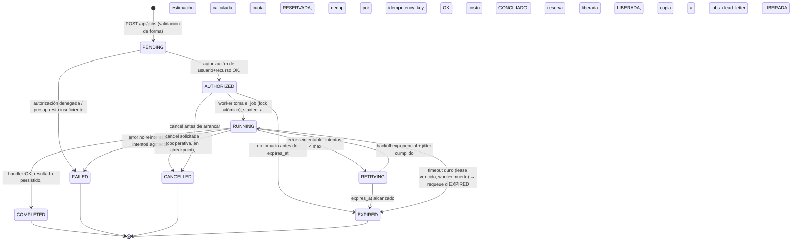

# P2 · Entregable 2 — Arquitectura objetivo

Objetivo: misma plataforma base (Next.js 16 + Supabase + Vercel), sin proveedores nuevos, con una capa de **jobs asíncronos**, **gobierno de costo de IA**, **trazabilidad append-only**, **resiliencia** y **operación** encima. Cada pieza se justifica en un ADR ([adr/](adr/)).

---

## 1. Vista de componentes objetivo

```mermaid
flowchart TB
    subgraph Cliente["Navegador"]
      UI["Tabs de licitación"]
      JOBUI["<JobStatus> — barra de progreso + resultado,
             suscrita a Realtime(jobs) con fallback a polling"]
    end

    subgraph Vercel["Vercel — Next.js 16 (entornos: preview / staging / production)"]
      API["Rutas /api (todas en apiRoute())"]
      ENQ["POST /api/jobs — crea job AUTHORIZED
           (valida, estima, reserva cuota, dedup por idempotency key)"]
      JOBSAPI["GET /api/jobs/:id · POST /api/jobs/:id/cancel"]
      HEALTH["/api/health · /api/ready"]
      CRONV["Vercel Cron:
             · tick worker (cada 1 min, respaldo)
             · limpieza jobs EXPIRED / logs / chunks
             · monitoreo sintético
             · alertas-vencimiento (ya existente)"]
      FLAGS["lib/flags — feature flags server-side (tabla + env)"]
    end

    subgraph Supabase["Supabase — 1 proyecto POR ENTORNO (prod ≠ staging ≠ dev)"]
      subgraph PG["PostgreSQL + pgvector"]
        JOBS[("jobs — cola + estado + metadata
               (job_id, org, user, tipo, recurso, estado,
                progreso, intentos, provider, modelo, tokens,
                costo, idempotency_key, result_ref, timestamps)")]
        DLQ[("jobs_dead_letter")]
        AIPOL[("ai_org_policy · ai_budget_ledger
                (reserva → consumo → conciliación)")]
        AIRES[("ai_results (append-only, versionado)
                ai_result_citations · prompt_templates")]
        AICACHE[("ai_cache — hash(contenido+prompt_ver+modelo) → resultado")]
        CB[("provider_health — estado de circuit breakers")]
        RET[("data_retention_policy · deletion_requests")]
        AUD[("audit_log (append-only, hash-encadenado)")]
      end
      QUEUE["pgmq (Supabase Queues) — cola de mensajes con
             visibility timeout, opcional; jobs table es la verdad"]
      PGCRON["pg_cron — tick del worker (cada 10 s) vía net.http_post"]
      EFW["Edge Function: job-worker
           (toma 1 job, ejecuta el handler del tipo, actualiza progreso,
            concilia costo, publica resultado, re-encola o DLQ)"]
      EFH["Edge Functions de dominio (las 9 actuales)
           refactorizadas a 'handlers de step' invocables por el worker"]
      RTS["Realtime — publication sobre public.jobs"]
      ST["Storage (buckets con lifecycle)"]
    end

    subgraph Externos
      ANT["Anthropic"]
      OAI["OpenAI"]
      RES["Resend"]
      SEN["Sentry"]
    end

    UI --> ENQ
    ENQ --> JOBS
    ENQ --> AIPOL
    JOBUI -.->|Realtime| RTS
    RTS -.-> JOBS
    JOBUI -->|polling fallback| JOBSAPI
    PGCRON --> EFW
    CRONV --> EFW
    EFW --> JOBS
    EFW --> QUEUE
    EFW --> EFH
    EFW --> AIPOL
    EFW --> AIRES
    EFW --> AICACHE
    EFW --> CB
    EFH --> ANT
    EFH --> OAI
    EFW --> DLQ
    EFW --> RES
    API --> SEN
    EFW --> SEN
```



## 2. Máquina de estados del job



### Esquema `public.jobs` (borrador — se afina en el incremento P2.1-a)

| Columna | Tipo | Nota |
|---|---|---|
| `id` | uuid pk | el `job_id` |
| `organization_id` | uuid not null → organizations | scope de RLS y de concurrencia |
| `requested_by` | uuid → users | usuario solicitante |
| `tipo` | text not null | enum de 11 tipos (§ inventario doc 1) |
| `recurso_tipo` / `recurso_id` | text / uuid | licitación, documento, checklist_item, referencia… |
| `estado` | text not null | enum de 8 estados |
| `prioridad` | smallint not null default 100 | menor = antes; interactivo=50, batch=100, masivo=200 |
| `progreso` | smallint 0–100 | actualizado por el handler en checkpoints |
| `progreso_detalle` | text | "generando embeddings 3/8" |
| `intentos` | smallint default 0 | |
| `max_intentos` | smallint default 3 | por tipo |
| `idempotency_key` | text | `unique (organization_id, idempotency_key)` |
| `dedup_hash` | text | `hash(tipo + recurso + content_hash + prompt_ver)` — índice para reutilización |
| `input_json` | jsonb | parámetros del job (redactado en logs) |
| `provider` / `modelo` | text | proveedor y modelo efectivos |
| `tokens_estimados` / `tokens_input` / `tokens_output` | int | estimado vs real |
| `costo_estimado_usd` / `costo_real_usd` | numeric(10,5) | |
| `reserva_id` | uuid → ai_budget_ledger | reserva de cuota asociada |
| `result_ref` | jsonb | `{ tabla, id }` o el resultado inline si es chico |
| `error_seguro` | text | mensaje redactado, apto para el cliente |
| `error_interno_ref` | text | request_id / Sentry id para el equipo |
| `lease_expires_at` | timestamptz | lock del worker; si vence, el job se puede retomar |
| `created_at` / `authorized_at` / `started_at` / `finished_at` / `expires_at` | timestamptz | ciclo de vida |

**RLS:** `select` para miembros de la org (`organization_id = user_org_id()`); sin `insert/update/delete` directo — todo pasa por RPCs `SECURITY DEFINER` (`crear_job`, `cancelar_job`) y por el service role del worker. Mismo patrón que `ai_usage_log`.

### Concurrencia y prioridad
- `crear_job` rechaza (o encola en `PENDING` con espera) si la org ya tiene `>= max_concurrent_jobs` en `RUNNING`/`RETRYING` (config en `ai_org_policy`).
- El worker selecciona con `... where estado in ('AUTHORIZED','RETRYING') and (lease_expires_at is null or lease_expires_at < now()) order by prioridad asc, created_at asc for update skip locked limit N`.
- `for update skip locked` = **prevención de procesamiento duplicado** sin depender de pgmq.

## 3. Worker

Una sola Edge Function `job-worker`, disparada por:
1. **pg_cron cada 10 s** (`net.http_post` al endpoint del worker) — latencia de arranque p95 < 10 s (SLO del brief).
2. **Vercel Cron cada 1 min** — respaldo si pg_cron/net fallan.
3. **Database Webhook opcional** en `insert on jobs` — arranque inmediato para jobs interactivos.

Cada invocación del worker: toma hasta N jobs (`skip locked`), y **por cada job ejecuta un solo "step"** acotado a caber en el wall-clock de la función (ver [adr/0002-worker-y-limites-de-ejecucion.md](adr/0002-worker-y-limites-de-ejecucion.md)). Operaciones largas (procesar PDF grande, propuesta técnica) se modelan como **varios steps** encadenados: cada step actualiza `progreso` y `result_ref` parcial, y re-encola el job para el siguiente step. Esto da **reanudación** y **cancelación cooperativa** gratis.

Handlers de step = las 9 Edge Functions actuales, refactorizadas para: (a) recibir su input del `jobs.input_json` en vez del body HTTP directo, (b) reportar progreso, (c) devolver `{ tokens_input, tokens_output, provider, modelo, result }` en vez de escribir el resultado final ellas mismas (lo hace el worker, transaccionalmente con la conciliación de costo).

Compatibilidad: durante la transición, las rutas siguen aceptando la llamada síncrona pero internamente crean un job y hacen **long-poll corto** (espera hasta ~8 s; si el job no terminó, devuelven `202 + job_id` y el front cambia a modo asíncrono). Feature flag `jobs.async_<tipo>` por tipo de operación.

## 4. Gobierno de costo de IA (P2.2)

```mermaid
sequenceDiagram
    participant ENQ as POST /api/jobs
    participant POL as ai_org_policy
    participant LED as ai_budget_ledger
    participant W as job-worker
    participant AI as Proveedor

    ENQ->>ENQ: 1. autorizar usuario + recurso (RLS)
    ENQ->>ENQ: 2. estimar tokens (tamaño de input × factor por tipo)
    ENQ->>POL: 3. leer cuota mensual, límite diario, límite por operación, modelos permitidos
    ENQ->>LED: 4. SELECT sum(reservado+consumido) del mes/día
    alt presupuesto insuficiente
        ENQ-->>ENQ: job PENDING→FAILED "presupuesto agotado" (o AUTHORIZED con modelo económico si la política lo permite)
    else OK
        ENQ->>LED: 5. INSERT reserva (estado=RESERVADO, monto=estimado)
        ENQ-->>ENQ: job AUTHORIZED (reserva_id)
    end
    W->>AI: 6. ejecutar (modelo elegido por política: económico para extracción/clasificación, avanzado solo si se justifica)
    AI-->>W: usage real
    W->>LED: 7. conciliar: reserva → CONSUMIDO con monto real; delta liberado
    alt fallo
        W->>LED: 7b. liberar reserva completa (estado=LIBERADO)
        W->>W: reintento NO cuenta contra cuota si el intento previo no produjo tokens facturables
    end
```

- **`ai_org_policy`** (1 fila por org, con defaults): `cuota_mensual_usd`, `limite_diario_usd`, `limite_por_operacion_usd`, `max_concurrent_jobs`, `modelos_permitidos text[]`, `politica_modelo` (`economico_por_defecto` | `avanzado_si_confianza_baja` | …), `alertas_umbral_pct int[]` (p. ej. `{50,80,95}`).
- **`ai_budget_ledger`** (append-only): `org, job_id, tipo, estado (RESERVADO|CONSUMIDO|LIBERADO), monto_usd, tokens_input, tokens_output, modelo, created_at`. El "presupuesto consumido" y los "cache hits" y "reintentos" son agregaciones de esta tabla + `ai_cache`.
- **`ai_cache`**: `key = sha256(contenido_normalizado + prompt_template_id + prompt_version + modelo + params_hash)` → `result_ref`, `hits int`, `created_at`, `expires_at`. Consultada por el worker antes de llamar al proveedor. **Deduplicación de embeddings**: `document_chunks` gana `content_sha256`; antes de generar un embedding se busca uno existente con el mismo hash en la org.
- **Reutilización sin sobrescribir**: un job cuyo `dedup_hash` ya tiene un `ai_results` COMPLETED y aprobado devuelve ese resultado (marcando `reused_from`) en vez de re-ejecutar, salvo `force: true`.
- **Dashboard admin** (`/configuracion/consumo-ia`, solo ADMIN): consumo por día/operación/modelo, presupuesto restante, top recursos, cache hit rate, reintentos — todo desde `ai_budget_ledger`/`jobs`, **sin exponer `input_json` ni prompts**.

## 5. Trazabilidad y calidad de IA (P2.3)

- **`prompt_templates`**: `id, nombre, version, cuerpo, esquema_salida_json, modelo_sugerido, params, activo, created_at`. Los prompts salen del código a esta tabla (o a archivos versionados cargados en seed). Cada llamada referencia `prompt_template_id` + `version`.
- **`ai_results`** (append-only, reemplaza el patrón "insertar otra fila suelta"): `id, organization_id, recurso_tipo, recurso_id, documento_id, documento_version, documento_sha256, tipo_analisis, prompt_template_id, prompt_version, provider, modelo, params_json, tokens_input, tokens_output, costo_usd, latencia_ms, resultado_json, nivel_confianza, salida_incompleta bool, estado_aprobacion (PENDIENTE|APROBADO|RECHAZADO), aprobado_por, aprobado_at, reemplaza_a uuid, reused_from uuid, created_at`. **Nunca UPDATE del `resultado_json`**; una corrección es una fila nueva con `reemplaza_a`.
- **`ai_result_citations`**: `ai_result_id, document_chunk_id, documento_id, pagina, seccion, extracto, score`. Todo hallazgo de IA que afirme algo sobre un documento enlaza sus chunks de evidencia. La UI muestra "según [documento] p. X".
- **Comparación entre versiones**: vista/endpoint que hace diff de `resultado_json` entre dos `ai_results` del mismo recurso.
- **Aprobación humana**: acciones críticas (declarar cumplimiento de un requisito, liberar propuesta) requieren un `ai_results.estado_aprobacion = APROBADO` por un rol con permiso. La IA marca `nivel_confianza` y `salida_incompleta`; la UI rotula "información no verificada" mientras esté PENDIENTE.
- **Evaluaciones automáticas** (`tests/evals/`): dataset de ~20–40 casos representativos (bases reales anonimizadas + salida esperada). Métricas: precisión de requisitos detectados, requisitos omitidos (recall), tasa de alucinación (afirmaciones sin cita válida), utilidad. Corren en CI (con API key de un proyecto de test) y como job programado semanal. Incluye casos de **prompt injection** (documento con "ignora las instrucciones…") que deben fallar de forma segura.
- La IA **asiste**; el sistema nunca marca "cumple legalmente" de forma automática y definitiva — siempre queda en PENDIENTE hasta aprobación humana.

## 6. Resiliencia (P2.5)

- **`lib/circuit-breaker`** (Node + Deno, duplicado como `ai-guard`): estado por proveedor en `provider_health` (`provider, estado CLOSED|OPEN|HALF_OPEN, fallos_consecutivos, abierto_hasta`). El worker consulta antes de llamar; si `OPEN`, el job va a `RETRYING` con backoff largo o se degrada.
- **`withRetry` v2**: clasifica errores (429/500/502/503/529/timeout = reintentable; 400/401/403/422 = no). Backoff exponencial **con jitter** (`base * 2^i * (0.5 + random*0.5)`). Límite de reintentos **facturables**.
- **Timeouts explícitos** por llamada de proveedor y **lease/timeout duro** por job.
- **Fallbacks concretos** (del brief):
  - Anthropic falla → el documento **no** se marca `procesado`; job a `RETRYING`/`FAILED`, nunca COMPLETED silencioso.
  - OpenAI embeddings falla → se conserva la extracción de texto (step previo ya COMPLETED con `result_ref` parcial); el job reanuda desde el step de embeddings.
  - Resend falla → la creación de invitación/job es idempotente (`unique` sobre token/`idempotency_key`); reintentar no duplica.
  - Realtime caído → el front hace polling a `GET /api/jobs/:id` (backoff 2→10 s).
  - Sentry caído → captura en try/catch, nunca bloquea la operación principal.
  - Generación interrumpida → el último step COMPLETED deja progreso verificable en `result_ref`.
- **Health/readiness**: `/api/health` (proceso vivo), `/api/ready` (Postgres + Storage + al menos un proveedor de IA alcanzables). Monitoreo sintético vía Vercel Cron que ejerce un flujo mínimo end-to-end.
- **Runbooks** en [runbooks/](runbooks/).

## 7. Rendimiento (P2.4)

- **Baseline primero**: instrumentar y capturar 1–2 semanas antes de optimizar (`03-plan-incremental.md`, incremento P2.4-a).
- **Presupuestos verificables** (CI + monitoreo), valores iniciales sujetos a baseline:
  - LCP < 2.5 s / INP < 200 ms / CLS < 0.1 en las 3 rutas más usadas.
  - API p95 < 800 ms (rutas no-IA); arranque de job p95 < 10 s.
  - Bundle JS por ruta < 200 KB gz (visor PDF, TipTap, gráficas = lazy).
  - Sin `select("*")`; toda lista paginada; `EXPLAIN ANALYZE` en las 10 consultas más caras.
- **pgvector**: tunear `hnsw.ef_search`, medir recall vs latencia; `search_chunks` con `limit` y timeout.
- **Retención de chunks/embeddings**: política por antigüedad de licitación (CERRADA + N meses → mover embeddings a cold o borrar, conservando el texto).
- **Realtime**: una suscripción por vista, cleanup en unmount, `GET` inicial + suscripción incremental.

## 8. Datos, privacidad, retención, DR (P2.6 / P2.7)

- **Clasificación** de cada tabla/bucket (públicos / internos / confidenciales / personales / fiscales / corporativos / propuestas económicas / llaves / resultados IA / logs) en [13-clasificacion-datos.md](13-clasificacion-datos.md).
- **`data_retention_policy`**: retención por clase; jobs de limpieza (Vercel Cron) para `rate_limit_hits` (7 d), `ai_usage_log`/`ai_budget_ledger` (13 meses fiscales), `jobs` COMPLETED/FAILED (90 d, luego a `jobs_archive`), `document_chunks` de licitaciones CERRADAS antiguas.
- **`deletion_requests`** + job `borrar-organizacion`: export previo → borrado ordenado (Postgres en orden de FK → Storage por prefijo → embeddings → jobs → verificación en proveedores → registro en `audit_log`). **`ON DELETE CASCADE` deja de ser el único plan.**
- **Export/portabilidad**: job `exportar-organizacion` → ZIP (JSON + documentos) a un bucket temporal con URL firmada de corta vida.
- **Redacción de datos en logs**: ya existe en `logApiError`; se extiende a jobs (`input_json` nunca se loguea crudo) y se documenta qué se envía a proveedores de IA y bajo qué condiciones (zero-retention API si aplica).
- **DR**: RPO/RTO objetivo, PITR de Postgres (requiere plan Pro — decisión en ADR), respaldo de Storage scripteado, y **una prueba de restauración real** en un proyecto Supabase aislado, documentada en [04-rollback-y-dr.md](04-rollback-y-dr.md).

## 9. Entrega continua (P2.8)

- Entornos: `local` (supabase CLI) · `test` (proyecto Supabase efímero para CI) · `preview` (Vercel preview + proyecto Supabase de staging o branch DB) · `staging` (proyecto Supabase dedicado) · `production` (proyecto Supabase dedicado). Secretos y env vars separados por entorno en Vercel + `supabase secrets` por proyecto.
- GitHub Actions: `lint + tsc + build + unit + integration (contra test project) + evals`; `migrations check` (aplicar contra DB efímera, detectar destructivas); `preview deploy`; `smoke tests` contra preview; **aprobación manual** para promover a producción; migraciones a prod **con respaldo previo y verificación**, nunca destructivas automáticas.
- Feature flags (`lib/flags`), rollback de app (Vercel instant rollback), rollback de DB (solo migraciones aditivas + toggle de flag; las destructivas van en dos fases: expand → migrate → contract).
- `CHANGELOG.md`, release notes, protección de `main`, CODEOWNERS, Dependabot/Renovate, SAST (CodeQL) + `npm audit` + escaneo de secretos (gitleaks) en CI.

## 10. Operación (P2.9) y producto (P2.10)

- Dashboard de salud (`/admin/salud` interno): jobs por estado, latencia de arranque, DLQ, circuit breakers, consumo IA vs presupuesto, errores 5xx, Core Web Vitals.
- Alertas por severidad (Sentry + webhook): SEV1 (caída) → page; SEV2 (DLQ creciendo, presupuesto de una org al 95%, p95 > 2×) → alerta; SEV3 → digest.
- SLO iniciales del brief (disponibilidad 99.9%, API p95 < 800 ms, arranque de job p95 < 10 s, errores < 0.5%, jobs sin intervención > 98%) con error budgets.
- Runbooks: revocación de sesiones, fuga de datos, consumo anormal de IA, documento malicioso, falla de migración, DLQ, proveedor caído.
- Producto: onboarding, planes/límites (mapeados a `ai_org_policy`), panel admin, página de estado, export, historial de actividad, `audit_log` inmutable (hash-encadenado) para acciones críticas, roles configurables sobre el modelo base, config por jurisdicción, versionado de formatos legales, avisos "la IA requiere revisión humana", consentimiento/términos, flujo "reportar resultado incorrecto" (crea un `ai_results` RECHAZADO + ticket), métricas de valor (tiempo ahorrado, requisitos detectados, omisiones evitadas, tasa de aceptación humana, coste por expediente) desde `jobs` + `ai_results` + `audit_log`.

## 11. Qué se conserva sin cambio

RLS y helpers; `apiRoute()` y su sobre de respuesta; `authenticate()`/`require*()` de Edge Functions; guardia anti prompt-injection; firma e.firma; `check_rate_limit`. P2 **añade capas encima**; no reescribe la seguridad de P0/P1.
